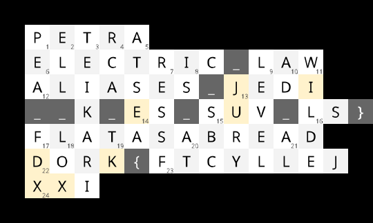

# [misc] is_jelly_stuck

<table><tbody>
<tr><th>Value</th><td>961 pts</td></tr>
<tr><th>Tags</th><td><code>medium</code></td></tr>
<tr><th>Author</th><td>Meow Mix</td></tr>
<tr><th>Files</th><td><a href="./files/clues.txt">clues.txt</a> · <a href="./files/upload_me_to_google_drive_if_you_want.xlsx">upload_me_to_google_drive_if_you_want.xlsx</a> · <a href="./files/grid.png">grid.png</a></td></tr>
</tbody></table>

Man, I don't know anything about computers or hacking. 
Let's just relax with an easy crossword puzzle...

**10 Point Hint:** I know what to do with the code and solved the thing it leads to.  Why isn't the flag working? Where is the flag?

**15 Point Hint:** I *don't* know what to do with the code. What do I do with it?

-----

**Note:** The .xlsx file is not required to complete this challenge but it's highly recommended to upload it to Google Drive to collaborate with your team!

---

raw notes:

  - crossword

    
  - across
    <table><thead>
    <tr><th>#</th><th>Clue</th><th>Answer</th></tr>
    </thead><tbody>
    <tr><td>1</td><td>Ancient "rose-red city"</td><td>Petra (in southern Jordan)</td></tr>
    <tr><td>6</td><td>Running off current</td><td>electric</td></tr>
    <tr><td>9</td><td>Statute</td><td>law</td></tr>
    <tr><td>12</td><td>Remi, Airi, Shiina, Rie, Erina, Panko</td><td>aliases</td></tr>
    <tr><td>13</td><td>Sci-fi star knight circa 1977</td><td>Jedi</td></tr>
    <tr><td>14</td><td>New Phase branch, maybe</td><td>ES</td></tr>
    <tr><td>15</td><td>Minivan alternative, abbr.</td><td>SUV</td></tr>
    <tr><td>16</td><td>Lists files in the current directory</td><td>ls</td></tr>
    <tr><td>17</td><td>Jelly is</td><td>flat as a bread (😑)</td></tr>
    <tr><td>22</td><td>Jelly is also a</td><td>dork (😑)</td></tr>
    <tr><td>23</td><td>This, backwards</td><td>jellyCTF (backwards)</td></tr>
    <tr><td>24</td><td>Roman blackjack?</td><td>XXI (i.e. 21 in Roman numerals)</td></tr>
    </tbody></table>
  - down
    <table><thead>
    <tr><th>#</th><th>Clue</th><th>Answer</th></tr>
    </thead><tbody>
    <tr><td>1</td><td>Basic projectile and legume</td><td>pea</td></tr>
    <tr><td>2</td><td>Letter, Jelly only takes</td><td>ell (for "L")</td></tr>
    <tr><td>3</td><td>Last name of developer, released a free beta on itch.io needed to solve this challenge</td><td>(Arvi) Teikari (creator of Baba Is You; the free beta is <a href="https://hempuli.itch.io/baba-is-you-level-editor-beta">https://hempuli.itch.io/baba-is-you-level-editor-beta</a>)</td></tr>
    <tr><td>4</td><td>Color TV pioneer</td><td>RCA</td></tr>
    <tr><td>5</td><td>Between ports</td><td>at sea</td></tr>
    <tr><td>7</td><td>... to ay resects</td><td>(P)ress F (to (p)ay res(p)ects)</td></tr>
    <tr><td>8</td><td>... you?</td><td>(BABA) IS (YOU)</td></tr>
    <tr><td>9</td><td>Yellow, left-to-right top-to-bottom, code</td><td>JIEU(-)DKXX (is the Baba Is You level code)</td></tr>
    <tr><td>10</td><td>Commonly blocked</td><td>ad</td></tr>
    <tr><td>11</td><td>Dorian Gray creator</td><td>(Oscar) Wilde</td></tr>
    <tr><td>13</td><td>Court panel</td><td>jury</td></tr>
    <tr><td>15</td><td>Co. that purchased AT&amp;T in 2005</td><td>SBC (Communications)</td></tr>
    <tr><td>17</td><td>Package delivery co. ticker symbol</td><td>FDX (for FedEx)</td></tr>
    <tr><td>18</td><td>Smoked salmon for breakfast</td><td>lox</td></tr>
    <tr><td>19</td><td>Killing your teammate, abbr.</td><td>TK</td></tr>
    <tr><td>20</td><td>What's that noise? Did someone __ me?</td><td>at (i.e. @)</td></tr>
    <tr><td>21</td><td>Yankovic</td><td>(Weird) Al</td></tr>
    </tbody></table>
  - next stage involves down 3 and down 9; Baba is You level code is `JIEU-DKXX`
    <table><thead>
    <tr><th>Game level</th><th>Crossword</th><th>Move → letter</th></tr>
    </thead><tbody>
    <tr><td></td><td></td><td>(start) → <code>j</code></td></tr>
    <tr><td></td><td></td><td>left → <code>e</code></td></tr>
    <tr><td></td><td></td><td>left → <code>l</code></td></tr>
    <tr><td></td><td></td><td>left → <code>l</code></td></tr>
    <tr><td></td><td></td><td>left → <code>y</code></td></tr>
    <tr><td></td><td></td><td>left → <code>C</code></td></tr>
    <tr><td></td><td></td><td>left → <code>T</code></td></tr>
    <tr><td></td><td></td><td>left → <code>F</code></td></tr>
    <tr><td></td><td></td><td>left → <code>{</code></td></tr>
    <tr><td></td><td></td><td>left → <code>k</code></td></tr>
    <tr><td></td><td></td><td>left → <code>r</code></td></tr>
    <tr><td></td><td></td><td>left → <code>o</code></td></tr>
    <tr><td></td><td></td><td>left → <code>d</code></td></tr>
    <tr><td></td><td></td><td>up → <code>f</code></td></tr>
    <tr><td></td><td></td><td>right → <code>l</code></td></tr>
    <tr><td></td><td></td><td>right → <code>a</code></td></tr>
    <tr><td></td><td></td><td>up → <code>k</code></td></tr>
    <tr><td></td><td></td><td>down → <code>a</code></td></tr>
    <tr><td></td><td></td><td>down → <code>r</code></td></tr>
    <tr><td></td><td></td><td>right → <code>k</code></td></tr>
    <tr><td></td><td></td><td>up → <code>t</code></td></tr>
    <tr><td></td><td></td><td>up → <code>_</code></td></tr>
    <tr><td></td><td></td><td>left → <code>k</code></td></tr>
    <tr><td></td><td></td><td>left → <code>_</code></td></tr>
    <tr><td></td><td></td><td>left → <code>_</code></td></tr>
    <tr><td></td><td></td><td>up → <code>a</code></td></tr>
    <tr><td></td><td></td><td>right → <code>l</code></td></tr>
    <tr><td></td><td></td><td>right → <code>i</code></td></tr>
    <tr><td></td><td></td><td>right → <code>a</code></td></tr>
    <tr><td></td><td></td><td>right → <code>s</code></td></tr>
    <tr><td></td><td></td><td>right → <code>e</code></td></tr>
    <tr><td></td><td></td><td>right → <code>s</code></td></tr>
    <tr><td></td><td></td><td>right → <code>_</code></td></tr>
    <tr><td></td><td></td><td>up → <code>c</code></td></tr>
    <tr><td></td><td></td><td>right → <code>_</code></td></tr>
    <tr><td></td><td></td><td>right → <code>l</code></td></tr>
    <tr><td></td><td></td><td>down → <code>e</code></td></tr>
    <tr><td></td><td></td><td>right → <code>d</code></td></tr>
    <tr><td></td><td></td><td>down → <code>_</code></td></tr>
    <tr><td></td><td></td><td>right → <code>l</code></td></tr>
    <tr><td></td><td></td><td>right → <code>s</code></td></tr>
    <tr><td></td><td></td><td>right(/finish) → <code>}</code></td></tr>
    </tbody></table>
  - flag is `jellyCTF{krodflakarkt_k__aliases_c_led_ls}`
  - meta: the second stage was pretty cool
